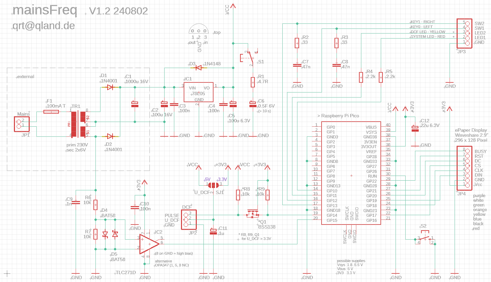

# **Graphical Mains Frequency Logger**

### Energy Transition Live in Black & White
Update every second, 15 hours loop, DCF time, Failure Display  
 

 

[**-> views**](#views)  
[**-> source**](source)

 

## Background
Grid frequency and grid voltage are important indicators of the load on an interconnected grid. Within such a grid, the frequency and phase of the generating components must be exactly the same. If deviations occur, the generators begin to work against each other, which in extreme cases can lead to severe damage or failure of the grid or parts of it. This highly dynamic system, consisting of many generators and millions of consumers, therefore needs to be constantly monitored and kept in balance.

Due to the increased feed-in of renewable energies such as wind and solar energy, this task has become significantly more complicated and, as a result, more difficult to balance. This is particularly evident on Sundays and public holidays with changing wind and solar conditions. Although, or precisely because, the grid load is lower due to less industrial electricity consumption, and there is a rapid succession of power surpluses or shortages due to changing weather conditions, the frequency regulators struggle to maintain balance. These fluctuations more often bring the grid to the limits of the established tolerances than when predominantly continuous generators such as hydro, coal, and nuclear power were fed in.

Regardless of whether you follow the grid frequency of, for example, the European interconnected grid at a socket in Germany, France, or Italy, the curve progression will be the same at any given time. Thus, you can monitor live how the grid is currently doing.

(There are also independent grid sections that are decoupled through direct current conversion and have their own phase positions.)

 
 German Text 

Netzfrequenz und Netzspannung sind wichtige Indikatoren für die Auslastung eines Verbundnetzes. Innerhalb eines solchen Netzes müssen Frequenz und Phase der erzeugenden Komponenten exakt gleich sein. Treten Abweichungen auf, beginnen die Erzeuger gegeneinander zu arbeiten, was im Extremfall von schweren Schäden bis zum Ausfall des Netzes oder Teilen davon führen kann. Dieses hochdynamische System aus vielen Erzeugern und Millionen von Verbrauchern muss deswegen ständig überwacht und im Gleichgewicht gehalten werden.

Durch vermehrte Einspeisung erneuerbarer Energien wie Wind- und Sonnenenergie ist diese Aufgabe wesentlich komplizierter geworden und dadurch schwerer zu tarieren. Das lässt sich insbesondere an Sonn- und Feiertagen mit wechselnden Wind- und Sonnenverhältnissen mitverfolgen. Obwohl oder gerade weil die Netzlast bedingt durch weniger industriellen Stromverbrauch geringer ist und durch wechselnde Wetterverhältnisse in rascher Folge Stromüberschuss oder -Mangel herrscht, haben die Frequenzhüter Mühe die Balance zu halten. Die Schwankungen bringen das Netz öfter an die Grenzen der festgelegten Toleranzen wie früher als überwiegend kontinuierliche Erzeuger wie Wasser-, Kohle- und Atomkraft eingespeist wurden.

Egal ob man die Netzfrequenz z. B. des europäischen Verbundnetzes an einer Steckdose in Deutschland, Frankreich oder Italien mitverfolgt, wird der Kurvenverlauf zu jedem Zeitpunkt der Gleiche sein. Somit kann man Live mitverfolgen wie es um das Netz gerade bestellt ist.

(Es gibt auch unabhängige Netzabschnitte die durch Gleichstromwandlung abgekoppelt sind und eigene Phasenlagen aufweisen) 

 

## Description

 
 

**1** - DC supply and mains AC wave connector  
**2** - DCF signal connector  
**3** - supply reserve switch  
**4** - reset push button  
**5** - debug connector  
**6** - system LED  
**7** - DCF LED  
**8** - left push button  
**9** - right push button

 

**1** - time base + screen time  
**2** - disturbance and fail counter  
**3** - page/pages  
**4** - DCF time  
**5** - DCF fail hours  
**6** - day of week and time  
**7** - mains fail

 

grid load gets heavier, mains frequency gets lower

 

grid load gets lighter, mains frequency gets higher

 

**Start**  
on engaging supply the system LED will flash rapidly  
press the right push button to start  

in some cases the system is not able to (re)start properly  
switch supply reserve off then press reset  
(supply reserve may be switched on again)

**System LED**  
normal operation is indicated by a short flash every second  
on engaging supply the system LED will flash rapidly (-> Start)  
if reserve capacitor voltage is low, the display freezes and  
the LED flashes rapidly until the capacitor is depleted

**DCF LED**  
will flash in the every second rhythm of the DCF signal  
after time is synced and verified the LED will light permanently  
on the hour time is synced and verified anew (the LED will flash again)  
if the LED lights up erratically DCF reception might be disturbed

**Time Base + Screen Time**  
the recording loop covers about 15 hours at one second resolution  
there are five time bases and resulting screen times selectable  
at highest resolution of one second, one screen includes about 5 minutes  
in lowest resolution 180 seconds the screen holds about 15 hours  
(-> Push Buttons)

**Page and Pages**  
depending on time base one can scroll through more or less recorded pages  
an asterisk in front of page means the display is not showing the current curve     
double press the right push button to see the current curve (the asterisk will disappear)  
(-> Push Buttons)

**Mains Fail Display**  
mains failure times will be displayed as hatched curve areas  
disturbances are displayed as checkered curve areas  
groups of disturbances and failures are counted in the disturbance and fail counters  
disturbances are additional impulses on the AC line  
fails are missing (half) waves on the AC line  
the counters are decremented as according data is shifted out of the buffer

**Mains Fail**  
supply reserve will endure some 10 s with a 0.5 F capacitor  
if the capacitor ran empty and mains comes up again, the system LED will flash rapidly  
while the display before the fail stays frozen until the right push button is pressed  
(-> Start)

## Push Buttons

| press | short  |  double  |  long        |
|-------|--------|----------|--------------|
|       | `page` |  `page`  |  `time base` |     
| left  | `-`    |  `first` |  `-`         |
| right | `+`    |  `last`  |  `+`         |

## Display Range

| display    | f in Hz | d in % | t in us | load     |
|------------|---------|--------|---------|----------|
| `top`      | 49.84   | - 0.32 | + 64    | high     |
| `mid line` | 50.00   | ± 0    | ± 0     | balanced |
| `bottom`   | 50.16   | + 0.32 | - 63    | low      |
(d for deviation)

| Official Mains Frequency Deviations ||
|------------|-----------|
| normal     | `± 0.1 %` |
| critical   | `± 0.4 %` |

 

## Schematic

 
 
 

**Edited and Developed with vsCode**  
https://code.visualstudio.com/  

**Compiled with**  
https://github.com/raspberrypi/pico-sdk

**Parts of the text were translated with help of GPT-4-turbo**  
https://chatgpt.com

 

---

 

## Views

ePaper Display 296 x 128 Pixel  

 
 

Front  

 
 

Back  

 
 

Insight  

 
 

 
 

---

[qrt@qland.de](mailto:qrt@qland.de) 240526
